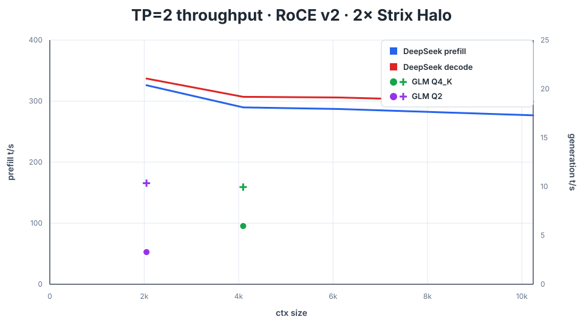

# DS4 Strix Halo TP over OdinLink, RoCE v2, or InfiniBand

Tensor-parallel **DeepSeek V4 Flash 0731** inference across two AMD Strix Halo
APUs. This fork runs the 153.32 GiB Q4_K model over consumer USB4/TB5 with
OdinLink GPU RDMA, over a Mellanox RoCE v2 link, or over a directly connected
native Mellanox InfiniBand cable (ConnectX-3, `mlx4`).

- **2 × Ryzen AI MAX+ 395 / Radeon 8060S**
- **2 × 128 GB installed RAM**
- **Tensor parallelism = 2**
- **Cache-free Q4_K production defaults**
- **256K-context server profile**

```text
 Ryzen AI MAX+ 395          RDMA link          Ryzen AI MAX+ 395
   Radeon 8060S       <================>          Radeon 8060S
      TP rank 0    OdinLink, RoCE v2, or IB          TP rank 1
```

## Performance (DeepSeek V4 Flash 0731)

| DeepSeek V4 0731 TP=2 configuration | Measurement | Prefill | Decode | Status |
|---|---|---:|---:|---|
| Original Q4_K baseline | archived pre-acceleration TP=2 run | **34.11 t/s** | **9.96 t/s** | historical baseline, not single-node scaling |
| **Huihui Q2_K over RoCE v2** | balanced 50/50, 2,048 prompt + 300 decode; paired regression check | **231.87 t/s** | **19.92 t/s** | one candidate run at `71e6a24`, 2026-09-15; exact FNV `5e0fa38210276c41`, zero fallback |
| **Antirez Q4_K over OdinLink** | balanced 50/50, 2,048 prompt + 300 decode; paired regression check | **270.10 t/s** | **19.89 t/s** | one candidate run at `71e6a24`, 2026-09-15; exact FNV `0163c44015591445`, zero fallback |
| **Antirez Q4_K over RoCE v2** | balanced 50/50, 2,048 prompt + 300 decode; paired regression check | **304.22 t/s** | **21.19 t/s** | one candidate run at `71e6a24`, 2026-09-15; exact FNV `0163c44015591445`, zero fallback |
| **Current Q4_K + DSpark** | 46/54 split | — | — | experimental revalidation pending |

The current rates are individual regression observations, not repeated-run
headline estimates. Both quantizations preserved the paired control fingerprint
and met the 3% regression limits. Huihui and Antirez use different model files;
their rates are not a controlled engine comparison. No expanded-weight cache
or payload fallback was used.

### Q4_K throughput through 10K context



This historical RoCE v2 sweep follows the upstream `ds4-bench` convention: each point
adds 2,048 prompt tokens at the stated context frontier, then measures 300
generated tokens. It uses the same diverse prompt corpus throughout. The
separate full 10,240-token prefill has a three-run median of **289.23 t/s**;
its decode median is **18.76 t/s**. The sweep has not been repeated for the
September 15 update.

```sh
DS4_BENCH_RDMA_PROFILE=roce-v2 \
  ./scripts/run-tp-context-sweep.sh q4-context-sweep \
  /absolute/path/to/DeepSeek-V4-Flash-Q4_K.gguf
```

### GLM-5.3 Flash TP=2 performance

These `ds4-bench-tp` results use 300-token decode at batch 256, with prompt
lengths shown per row (4,096 for Q4 and 2,048 for Q2). The staged GLM-5.3
Flash TP=2 path is included in this fork and remains isolated from
DeepSeek's graph executor.

| Configuration | Measurement | Prefill | Decode | Status |
|---|---|---:|---:|---|
| **GLM-5.3 Flash Q4_K over RoCE v2** | 4,096 prompt + 300 decode, batch 256; geometric mean of nine paired runs | **93.43 t/s** | **10.29 t/s** | source `71e6a24`, 2026-09-15; exact FNV `9012bd4d7c5ce422`, zero fallback |
| **GLM-5.3 Flash Q4_K over OdinLink** | 4,096 prompt + 300 decode, batch 256; one matched diagnostic pair | **97.89 t/s** | **9.77 t/s** | candidate `71e6a24`, 2026-09-15; exact FNV `9012bd4d7c5ce422`, zero fallback |
| **GLM-5.3 Flash Q2 over RoCE v2** | 2,048 prompt + 300 decode, batch 256; one matched diagnostic pair | **36.31 t/s** | **10.39 t/s** | candidate `71e6a24`, 2026-09-15; mixed IQ2_XXS/Q2_K, exact FNV `4dabfb16bc99c81b`, zero fallback |

The Q4_K RoCE v2 result uses the unchanged original Antirez GGUF and overall
decode throughput. All nine runs are retained, including the 58.71 t/s prefill
sample. The matched control averaged 87.45/10.11 t/s. Numerical300, paired
100-case quality, 8K context, and DeepSeek Q4/Q2 checks passed. The 300 prefill /
20 decode t/s GLM target remains unmet. See the [measured recipe](docs/GLM53-ROCE-RECIPE.md).

The other two GLM rows are single candidate observations. Their matched
controls measured 90.79/9.74 t/s for Q4 OdinLink and 38.44/10.52 t/s for Q2
RoCE v2; the latter pair showed 5.5% lower candidate prefill.

The DeepSeek table above uses `ds4-bench-tp`: a fixed 2,048-token prefill
followed by 300 generated tokens over mandatory RDMA. Its main Q4_K rows
use the Antirez reference model listed below. The Antirez Q4_K model does not
fit one 128 GB node; TP=2 keeps one expert shard on each node. Q2_K
and Q4_K run without a persistent expanded-weight cache.

The `main` branch tracks the pinned ROCm 7.14 gfx1151 toolchain used for these
release results.

GLM-5.3 Flash support uses a staged TP=2 path that keeps the model's KDA state
sharded by attention head and does not change the validated DeepSeek production
path. The launcher applies the validated cache-free GLM staged environment and
the full-logits sampling contract. The
sampling-mode correction is documented at
`$DS4_RESEARCH_ROOT/glm5-next-tp2/deployment-debug-20260903.md`; the full staged
optimization record is at
`$DS4_RESEARCH_ROOT/glm5-next-tp2/staged-optimization-plan-20260901.md`.

The ordinary benchmark and deployment launchers enable the validated ordered
ROCm TP callback, temporal-compressor schedule, shape-gated M256/K128 Q8
projection, cooperative HC decode stage, exact long-context indexer top-k, and
RoCE prefill wavefront automatically. The wavefront provider-gates itself off
on OdinLink. DSpark stays opt-in and does not inherit that target-only
schedule.

The table reports reproducible inference results, not a single-node scaling
claim. Raw runs, fingerprints, kernel decisions, rejected candidates, memory
policy, and maintainer gates are preserved locally under
`$DS4_RESEARCH_ROOT/reports/strix-halo-tp-validation-2026-08/`.

## Supported and tested models

| Model source | Tested target files | Support |
|---|---|---|
| [Antirez DeepSeek V4 GGUF](https://huggingface.co/antirez/deepseek-v4-gguf) | `DeepSeek-V4-Flash-Q4KExperts-F16HC-F16Compressor-F16Indexer-Q8Attn-Q8Shared-Q8Out-chat-v2-imatrix-0731.gguf` (164,633,502,592 bytes) | **Recommended.** Used for the current Q4_K OdinLink and RoCE v2 rows. |
| [Huihui DeepSeek V4 Flash 0731 GGUF](https://huggingface.co/huihui-ai) | `DeepSeek-V4-Flash-Q2_K-0731.gguf`; `DeepSeek-V4-Flash-Q4_K-0731.gguf` | Supported. Q2_K is used for the current RoCE v2 row; Q4_K has separate research measurements. |
| [GLM-5.3 Flash GGUF](https://huggingface.co/antirez/glm-5.3-flash-gguf) | GLM-5.3 Flash Q4/Q2 GGUF targets | Supported through the staged TP=2 path; Q4 is the validated reference configuration. |
| Unsloth DeepSeek V4 Flash 0731 `UD-*` target weights | — | **Not supported:** their mixed-precision tensor layouts do not match the currently validated DS4 target paths. |

The Unsloth warning applies to `UD-*` target-model weights, not to a separately
documented optional DSpark drafter.

## Quick start

Both nodes need ROCm support for `gfx1151`, passwordless SSH from the
coordinator to the worker, and their own local copy of the same repository
commit and GGUF at the same absolute paths. Their filesystems are not shared.

Follow [DS4 on Strix Halo](STRIXHALO.md) for the Ubuntu 26.04 ROCm 7.14
tarball, rocWMMA header isolation, memory-layout decision, Secure Boot check,
and coordinator-to-worker SSH setup. Ubuntu 26.04 apt currently supplies ROCm
7.1; it is not a substitute for the validated 7.14 bundle.

Build on both nodes:

```sh
git clone https://github.com/wkljohn/ds4-strix-halo-tp-odinlink.git
cd ds4-strix-halo-tp-odinlink
HIP_PATH=/absolute/path/to/rocm-7.14.0 \
CPATH=/absolute/path/to/rocm-7.14.0/include \
CPLUS_INCLUDE_PATH=/absolute/path/to/rocm-7.14.0/include \
DS4_ROCM_HOME=/absolute/path/to/rocm-7.14.0 \
  make -j"$(nproc)" strix-halo
```

`DS4_ROCM_HOME` must name the ROCm 7.14 installation root containing
`bin/hipcc`; setting it explicitly prevents an older `/opt/rocm` installation
from being selected accidentally.

Create the benchmark configuration on node 1:

```sh
cp bench.env.example bench.env.local
$EDITOR bench.env.local
```

Set the peer SSH address, peer repository path, coordinator RDMA address,
transport devices, output directory, and—when using OdinLink—the local
`OdinLink-Five` path. The launcher then verifies both binaries, samples both
model copies, starts both cold model loads together, requires explicit RDMA,
and rejects transport fallback.

Run one fixed Q4_K benchmark:

```sh
./run-tp-ds4-bench.sh q4-r1 \
  /absolute/path/DeepSeek-V4-Flash-Q4_K-0731.gguf
```

Select `DS4_BENCH_RDMA_PROFILE=roce-v2` in `bench.env.local` for Mellanox
RoCE v2, or `ib-mlx4` for native Mellanox InfiniBand.
Use two distinct tags (`q4-r1`, `q4-r2`) and report their midpoint. Candidate
fingerprints and the combined pre-main test belong to the
local validation archive at
`$DS4_RESEARCH_ROOT/reports/strix-halo-tp-validation-2026-08/`, not
normal installation.

## OdinLink over USB4/TB5

Install the OdinLink driver on both hosts using the
[OdinLink-Five instructions](https://github.com/wkljohn/OdinLink-Five). The
validated userspace provider is pinned below:

```sh
sudo apt install build-essential cmake linux-headers-"$(uname -r)" \
  libibverbs-dev rdma-core pkg-config libglib2.0-dev
git clone https://github.com/wkljohn/OdinLink-Five.git
git -C OdinLink-Five checkout 65d4dd489c3c42ec4f1f50cc7bf672060fa3d0fc
cmake -S OdinLink-Five -B OdinLink-Five/build \
  -DBUILD_VERBS=ON -DBUILD_DAEMON=ON -DBUILD_TRAY=OFF
cmake --build OdinLink-Five/build -j"$(nproc)" \
  --target driver odl_tb5_cli odl_tb5_verbs odl_tb5_verbs_provider
```

Disable Secure Boot or enroll a trusted module-signing key before loading the
out-of-tree driver. Install the same commit on both nodes and normally load it
without `odl_ring_size`: each node first selects a size it can allocate, then
both negotiate the smaller selection. The character device is created only
after both peers advertise the OdinLink Thunderbolt service. Verify the device
and link before loading the model:

```sh
ls -l /dev/odl_tb5_0
# Node 1
./OdinLink-Five/build/cli/odl_tb5_cli server -d 0
# Node 2
./OdinLink-Five/build/cli/odl_tb5_cli client -d 0 -t latency

# Both nodes: require READY and matching local/peer packet-slot counts
./OdinLink-Five/build/cli/odl_tb5_cli diag -v
```

Set `DS4_ODINLINK_ROOT`, both `odl_tb5_0` device names, and the coordinator's
OdinLink address in `bench.env.local`. The optimized provider and Strix Halo
settings are already defaults; users should not copy diagnostic environment
switches into production. The provider looks for IPv4 on `bond0`, then
`thunderbolt0`. For a differently named data interface, append
`ODL_RDMA_GID_IFACE=<interface>` to the benchmark command so the same strict
choice reaches both ranks.

## Mellanox RoCE v2

Install system verbs on both nodes and keep OdinLink provider variables out of
the RoCE environment:

```sh
sudo apt install rdma-core ibverbs-utils perftest libibverbs-dev
unset DS4_TP_VERBS_LIB ODL_VERBS_WC_STREAM_COPY DS4_TP_ODINLINK_BATCH_ASYNC
```

Give the directly connected interfaces addresses on one subnet and enable a
9,000-byte MTU. Substitute each host's netdev and address:

```sh
sudo ip link set <mlx5-netdev> mtu 9000 up
sudo ip addr replace <node-address>/24 dev <mlx5-netdev>
```

Find an IPv4-mapped RoCE v2 GID and prove that mlx5 can register DS4's mapped
communication slab:

```sh
cat /sys/class/infiniband/<mlx5-device>/ports/1/gid_attrs/types/<gid-index>
make tests/roce_v2_mr_probe
./tests/roce_v2_mr_probe <mlx5-device>
```

The GID output must be `RoCE v2`; the probe must pass its mapped-host,
three-MR layout. Put the coordinator address, both device names, and GID index
in `bench.env.local`, set `DS4_BENCH_RDMA_PROFILE=roce-v2`, and run the same
benchmark command. Reference hardware details and the registration pitfall are
documented locally under `$DS4_RESEARCH_ROOT/reports/roce-v2-2026-08-14/`.

## Mellanox InfiniBand (ConnectX-3, mlx4)

A directly connected native InfiniBand cable (no RoCE GID-type or 9,000-byte
MTU configuration) uses the generic verbs path: RC queue pairs, 16 KiB decode
framing, and a single full-slab MR. RC is required because the exchanges are
full-duplex post-recv/post-send: a UC SEND that reaches the peer before its
RECV WR is armed is dropped silently (no RNR retry) and hangs the round,
while RC retransmits on RNR. Install the same system verbs on both nodes and
keep the OdinLink provider variables unset:

```sh
sudo apt install rdma-core ibverbs-utils opensm
unset DS4_TP_VERBS_LIB ODL_VERBS_WC_STREAM_COPY DS4_TP_ODINLINK_BATCH_ASYNC
```

Run a subnet manager on one node so both directly connected ports receive
LIDs, and give the InfiniBand network devices addresses on one subnet for the
TCP control plane:

```sh
sudo opensm
sudo ip addr replace <node-address>/24 dev <ib-netdev>
rdma link show    # both ports must be ACTIVE with LIDs 1 and 2
```

Prove that the device can register DS4's mapped communication slab. GID 0 is
the canonical native-IB GID and is also selected automatically when no
IPv4-mapped GID exists:

```sh
ibv_devinfo -d <ib-device>
make tests/roce_v2_mr_probe
./tests/roce_v2_mr_probe <ib-device>
```

In `bench.env.local`, set `DS4_BENCH_RDMA_PROFILE=ib-mlx4`, the coordinator's
InfiniBand interface address, both device names from `ibv_devinfo -l`
(udev may name them like `ibp195s0`), and `DS4_RDMA_GID_INDEX=0`; then run the
same benchmark command. For a manual two-node run, pass
`--transport rdma --rdma-device <ib-device> --rdma-gid-index 0` on both ranks.

## Production server

The included 256K profile starts both independent model loads together, keeps
the API on `127.0.0.1:8090`, and supports either RDMA transport behind Caddy:

```sh
cp deploy/config.env.example deploy/config.env.local
sed -i "s/^DS4_SERVER_SHA256=.*/DS4_SERVER_SHA256=$(sha256sum ./ds4-server | awk '{print $1}')/" \
  deploy/config.env.local
$EDITOR deploy/config.env.local
deploy/ds4-tp-caddy.sh start
deploy/ds4-tp-caddy.sh status
```

See [deploy/README.md](deploy/README.md) for the required Caddy route, RoCE
memlock handling, logs, and stop/restart commands.

OpenCode can use the deployed service as an OpenAI-compatible provider by
pointing its base URL at `http://127.0.0.1:8090/v1` (or the Caddy URL), selecting
the model name returned by `GET /v1/models`, and supplying the server API key if
authentication is enabled.

### GLM-5.3 deployment

The ordinary GLM-5.3 TP launcher and its cache-free staged kernel settings
are included in `main`. Build the same source revision with the same ROCm
toolchain on both nodes, or deploy matching binaries from one build:

```sh
make -j"$(nproc)" strix-halo
```

In `deploy/config.env.local`, set the local GLM model and enable the ordinary
path:

```sh
MODEL=/absolute/path/GLM-5.3-Flash-Q4_K.gguf
GLM5_ENABLE_ORDINARY=1
GLM5_FULL_LOGITS=0
GLM5_PREFILL_BATCH=256
```

The selected `GLM-5.3-Flash-Uncensored-Q4_K-ds4.gguf` also runs through this
path without converting its weights. Set `MODEL` to that file's absolute path
on both nodes. Its kernel research and performance promotion are separate from
the Antirez measurements above. For the mandatory RoCE v2 configuration, set
`RDMA_PROFILE=roce-v2`, the local/peer Mellanox devices and `RDMA_GID_INDEX=3`
in the deployment config, and keep `DSPARK=0`. Start with `CONTEXT=16384`;
benchmark evidence does not establish arbitrary long-context or multi-turn
server correctness.

Then populate `DS4_SERVER_SHA256` from the freshly built `ds4-server` and start
both ranks with `deploy/ds4-tp-caddy.sh start`. The launcher applies GLM's
full-logits sampling mode (`DS4_TP_GREEDY_TOP2=0`) after the generic DeepSeek
defaults; this prevents the post-prefill sampling failure fixed in commit
[`17cae42`](https://github.com/wkljohn/ds4-strix-halo-tp-odinlink/commit/17cae42).
It also enables the validated GLM staged kernels from
[`216a861`](https://github.com/wkljohn/ds4-strix-halo-tp-odinlink/commit/216a861)
only for GLM. DeepSeek defaults and cache-free memory policy are unchanged.

Agent clients should send an explicit completion limit. A practical starting
point is 4,096–8,192 tokens: if the model leaves a DSML tool call open, DS4
repairs it at the request limit, so an unnecessarily large limit can look like
a stalled request even while decode is progressing.

## Research and maintenance

- Local TP validation archive: `$DS4_RESEARCH_ROOT/reports/strix-halo-tp-validation-2026-08/`
- Local RoCE v2 A/B archive: `$DS4_RESEARCH_ROOT/reports/roce-v2-2026-08-14/`
- [OdinLink integration record](ODINLINK.md)
- [Kernel and architecture reports](docs/)
- [OpenAI-compatible server benchmark](docs/API-BENCHMARK.md)
- [Safe upstream synchronization](docs/UPSTREAM-SYNC.md)

To prepare—but not automatically commit—an upstream update:

```sh
git switch main
git pull --ff-only origin main
./scripts/prepare-upstream-sync.sh
```

## When to use upstream DS4

This fork is for **dual-Strix-Halo TP=2 over OdinLink, RoCE v2, or
InfiniBand**. For general
DS4 usage—including model downloads, single-node inference, Metal, CUDA,
multi-GPU CUDA, SSD streaming, pipeline parallelism, the server, and the coding
agent—use the canonical [antirez/ds4](https://github.com/antirez/ds4) README and
[DwarfStar documentation](https://dwarfstar.sh/docs/quickstart/).

The fork preserves upstream backends and non-TP paths, but does not duplicate
their user manual. Canonical changes are brought in through the documented
review branch so the Strix Halo and RDMA paths can be revalidated before merge.

## Acknowledgements

This project is a fork of [DS4](https://github.com/antirez/ds4) and retains its
license and attribution. DS4 in turn depends on ideas and formats pioneered by
[llama.cpp](https://github.com/ggml-org/llama.cpp) and GGML. See
[LICENSE](LICENSE) and the repository history for complete notices.
